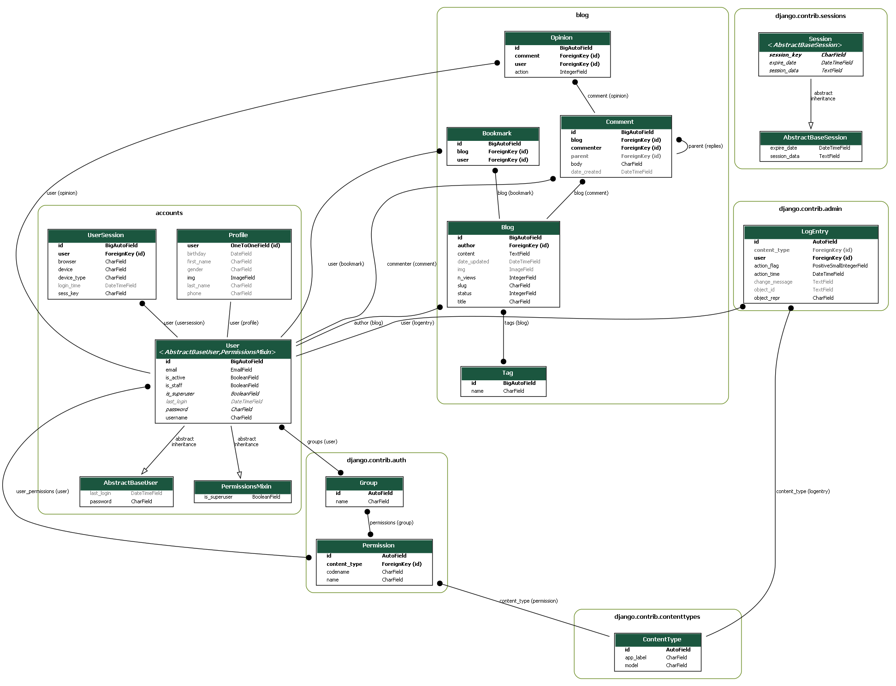
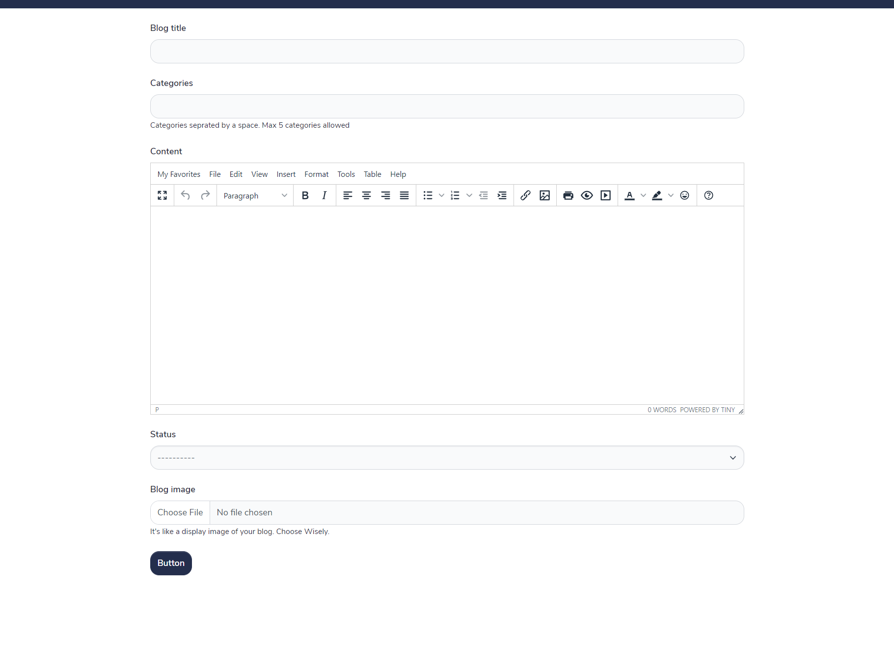
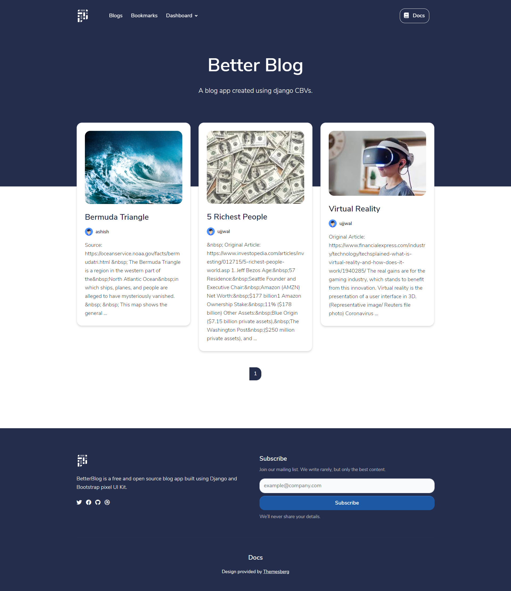
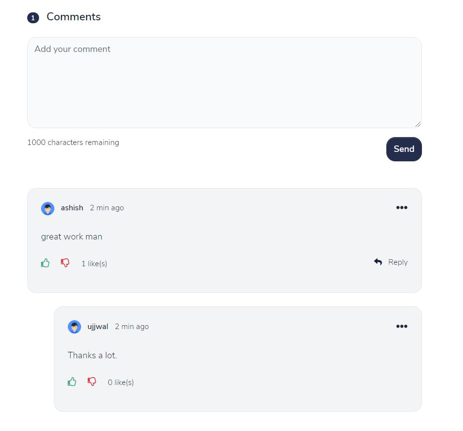
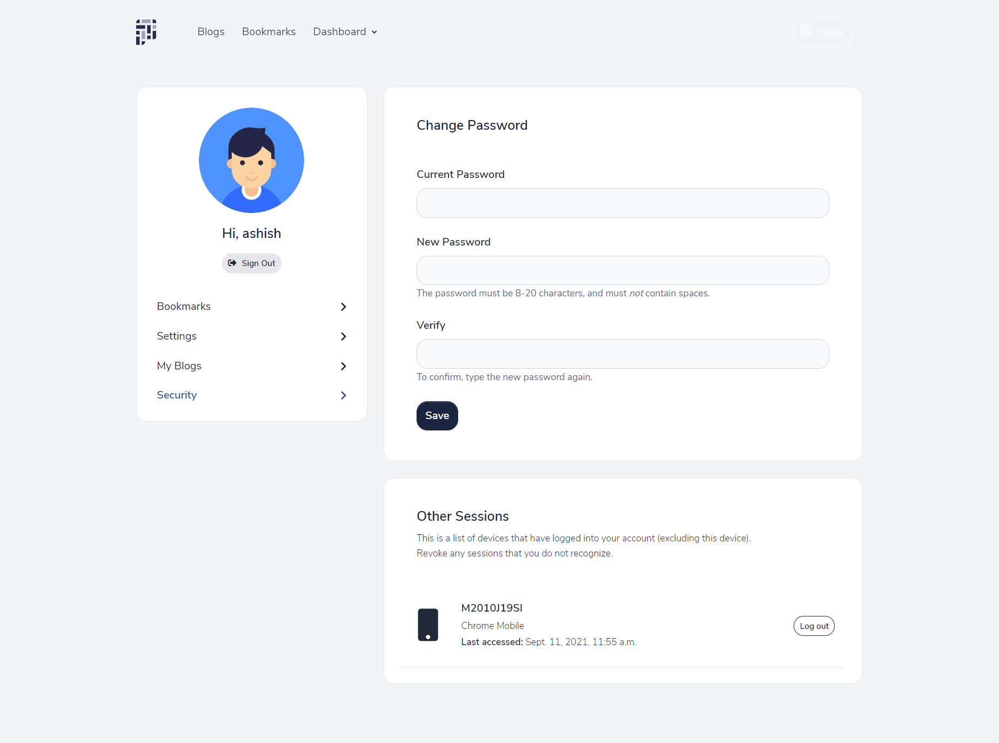

# BetterBlog

This project can be found live [here](https://betterblog.pythonanywhere.com/)

Test Login details ([login](https://betterblog.pythonanywhere.com/accounts/login/)) <br/>
email : damaca6483@shbiso.com <br/>
password: admin123@

A blog app created using django CBVs.

## Features (basic blog functionality +)

+ Anyone can create blogs.
+ Complete authentication system built from scratch.
+ A built in text editor for writing blogs.
+ A user can also reply, like or dislike a comment.
+ Saves multiple sessions of a user.
+ Responsive design




## Usage

```
git clone https://github.com/AshishPandagre/better-blog.git
cd better-blog
pip install -r requirements.txt
python manage.py migrate
python manage.py createsuper    // enter details.
python manage.py runserver
```

## Screenshots





Design provided by [Themesberg](https://themesberg.com/product/ui-kit/pixel-free-bootstrap-5-ui-kit)
